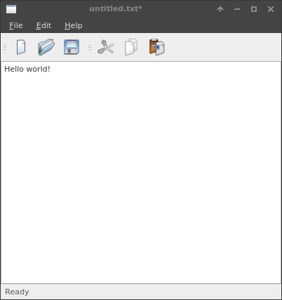

# Введение
Тестирование является одним из основных этапов разработки программного обеспечения. Его используют для решения довольно широкого спектра задач, среди которых можно выделить две наиболее существенные:
* Продемонстрировать работодателю корректную работу программы, в соответствии с поставленной задачей и заявленными целями.
* Обнаружить и своевременно выявить дефекты в работе приложения.

Разделяют два вида тестирования: Ручное и автоматическое.
Ручное тестирование выполняется специалистом - тестировщиком, без использования специализированных программных средств и предназначено для выявления ошибок в работе приложения путём моделирования действий пользователя. Основной и главной проблемой ручного тестирования является человеческий фактор, а как следствие низкая скорость работы, высокая ресурсоемкость и увеличение ошибок с течением времени. Поэтому в настоящее время ручное тестирование применяется только для интеграционного и системного тестирования, основное же модульное тестирование производится автоматически.   
Автоматизация тестирования - использование специализированных приложений или модулей для проведения определённых тестов. К основным преимуществам автоматического тестирования можно отнести: высокая скорость работы, автоматические отчёты, выполнение в фоне.   
В связи с переходом от ручного тестирования к автоматическому, возникает широкий класс задач связанных с автоматической проверкой работы графического пользовательского интерфейса (GUI). Популярен такой вид тестирования по двум причинам: во-первых, приложение тестируется тем же способом, которым его будет использовать человек, во-вторых, можно тестировать приложение, не имея при этом доступа к исходному коду. В связи с этим порой возникает задача автоматизации GUI вне контекста тестирования, то есть задача управления GUI приложением извне и извлечение данных из него.  
# Постановка задачи
Отсутствие единых стандартов программных интерфейсов (API) для взаимодействия тестовых фреймворков с приложением является основной проблемой автоматического тестирования GUI. Существует несколько способов управления GUI приложением извне:
* Координатный метод.
* Распознавание образов.
* Использование механизмов реализации специальных
возможностей (accessibility) и особенности реализации некоторых GUI фреймворков.    

К основным преимуществам координатного метода можно отнести: быструю разработку тестов и простоту поиска элементов при неизменности условий. Среди недостатков можно выделить такие как:
* Крайне дорогая поддержка тестов
* Зависимость тестов от настроек платформы (разрешение, шрифты, DPI и т.п)
* Невозможность получать данные о GUI приложения в каком либо структурированном виде

Распознавание образов. В основу этого метода положен метод поиска элементов UI c использованием распознавания образов и сравнения с образцом. Основными преимуществами данного метода, так же как и в координатном методе являются: высокая скорость разработки тестов и простота поиска элементов. К недостаткам данного метода можно отнести:
* Низкая "интеллектуальность" тестов
* Дорогая поддержка
* Зависимость тестов от настройки платформы.
* Невозможность получать данные о GUI приложения в каком либо структурированном текстовом виде
* Высокие вычислительные затраты на работу алгоритмов

Вышеописанные способы предполагают лишь обнаружение объектов в приложении, но не взаимодействие с ними. Использование же accessibility технологии дает возможность управлять объектами приложения. Однако такое взаимодействие будет далеко от реального обращения пользователя с программой.
Вследствие чего возникает задача эмулирования пользовательских действий фреймворком тестирования.    
Рассмотрим два основных метода взаимодействия пользователя с программой:
* Управление объектами с помощью мыши
* Ввод данных или использование специальных сочетаний клавиш с помощью клавиатуры.   

Далее нами будут рассмотрены наиболее распространённые способы и средства эмулирования пользовательских действий в существующих фреймворках автоматического тестирования GUI.

## Существующие решения
Рассмотрим существующие решения с позиции применяемых для тестирования методов.

| Инструменты     | Координтаный метод | Распознование образов | accessibility технологии | Язык   | Кроссплатформенность |
|-----------------|--------------------|-----------------------|--------------------------|--------|----------------------|
| AutoHotkey      | +                  |                     | -                        | С++    | Windows only         |
| autopy          | +                  | +                     | -                        | Python | +                    |
| pyautogui       | +                  | -                     | -                        | Python | +                    |
| TestStack.White | +                  | -                     | WPF, win32, WinForms, Silverlight, SWT                        | C#     | Windows only         |
| pywinauto       | +                  | -                     | WPF, WinForms, UIA                        | Python | Windows only         |
| Winium.Desctop  | +                  | -                     | WinForms, WPF                       | C#     | Windows only         |

Отдельно стоит рассмотреть pywinauto: бесплатная библиотека для языка python, состоящая из набора модулей, предназначенных для автоматического гибкого взаимодействия с Microsoft Windows GUI.
Эмулирование пользовательских действий в pywinauto  
реализовано с помощью win32api - библиотеки  Windows содержащая набор классов, процедур, функций структур и констант, которые используют программы для создания и работы с окнами в ОС Windows.   

Минус - отсутствие кроссплатформенности, в связи с чем было принято решение о портирование некоторых модулей данной библиотеки, а в дальнейшем и всей библиотеки под системы Linux и Mac os. Так как аналогичных кроссплатформенных библиотек, обладающих таким широким спектром решаемых задач под данные системы не существует, удобней было бы иметь один тестовый фреймворк под все системы.

<!-- Нужной найти список приложений аналогов / конкурентов под Windows / Linux -->
### TBD

# X Window System
X Window System оконная система, обеспечивающая стандартные инструменты и протоколы для построения графического интерфейса пользователя. Используется в UNIX-подобных ОС.

X Window System обеспечивает базовые функции графической среды: отрисовку и перемещение окон на экране, взаимодействие с устройствами ввода, такими как, например, мышь и клавиатура. X Window System не определяет деталей интерфейса пользователя — этим занимаются менеджеры окон, которых разработано множество. По этой причине внешний вид программ в среде X Window System может очень сильно различаться в зависимости от возможностей и настроек конкретного оконного менеджера.   

Работа с клавиатурой в X Window:  когда пользователь нажимает (отпускает) клавишу, сервер получает соответствующий сигнал, который преобразуется в событие и отправляется в очередь программы, имеющей фокус ввода (input focus).   
Так как клавиатура обычно у машины одна, она разделяется между всеми одновременно выполняющимися программами. Сигнал, поступающий от устройства доступен лишь одной из них, как правило, той, которой принадлежит активное окно. Под этим и стоит понимать, что программа и её окно имеют фокус ввода. Последний может переходить от окна к окну и от программы к программе.

Работа с мышью в X Window: общение программы с мышью похоже на работу с клавиатурой, X-сервер получает сигналы от устройства, преобразует их в события и помещает последние в очередь программы. Тем не менее, есть существенная разница: если события от клавиатуры передаются лишь программе, окно которой имеет фокус ввода, то события от мыши могут передаваться любой задаче, окно (окна) которой присутствуют на экране.

# Python Xlib
Python-xlib библиотека на языке Python (на чистом Python, без C/C++ расширений), предоставляющая удобный API для работы с X Window System со стороны клиента.
Рассмотрим основные используемые функции и классы этой библиотеки:    
`Display()`: создает объект класса Display который устанавливает соединение клиента с X сервером.
`fake_input(display, event_type, x, y)`: функция, принимающая текущее соединение клиента с Х сервером, и структуру типа event_type - тип события. Интересующее нас событие XKeyEvent

Когда пользователь нажимает клавишу клавиатуры, программа получает событие KeyPress. Сервер также может послать событие KeyRelease, когда клавиша отпускается, но это справедливо не для всех типов компьютеров.   
Оба этих события сопровождаются структурой типа XKeyEvent. Ее поле keycode содержит код нажатой клавиши, а поле state - состояние клавиш-модификаторов и кнопок мыши. Модификаторами называются такие клавиши, как Shift, Ctrl, Caps Lock. Кроме этого, X предусматривает наличие дополнительных модификаторов, которые обозначаются Mod1, ..., Mod5. Каждой нажатой клавише-модификатору и кнопке мыши соответствует флаг в поле state.   
Коды, передаваемые через поле keycode структуры XKeyEvent, однозначно идентифицируют клавиши. Их конкретные значения зависят от типа машины и клавиатуры. Эти коды можно назвать физическими. Чтобы обеспечить переносимость программ, сервер устанавливает соответствие между физическими кодами клавиш, которые могут меняться от компьютера к компьютеру, и целочисленными константами - логическими кодами (символами).    

`keycode_to_keysym`: позволяет по коду keycode получить соответствующий ему символ с номером index. Если index равен 0, то полученный символ соответствует просто нажатой клавише. Если index равен 1, то возвращается символ,соответствующий ситуации, когда клавиша нажата одновременно с Shift.    

`keysym_to_keycode`: Осуществялет обратное преобразование.

# Исходная реализация модулей в pywinauto
Работа с мышью в pywinauto была реализованна в модуле `HwndWrapper`. Данный модуль является оболочкой для стандартных возможностей win32api по управлению объектами окна. Одной из основных возможностей данного модуля является способность посылать окну приложеия событий мыши, причем их передача может быть реализованна двумя способами: с помощью accessibility технологий в функции `perform_click()` и user like с помощью win32 функций в функции `perform_click_input()`. Также имелись функции предоставляющие удобное обращение к определенным операциям:
* `DoubleClick()`, `DoubleClickInput()` - Двойной клик.
* `RightClick()`, `RightClickInput()` - Клик правой кнопкой мыши.
* `PressMouse()`, `PressMouseInput()` - Нажатие и удержание заданной кнопки мыши.
* `ReleaseMouse()`, `ReleaseMouseInput()` - Освобождение удерживаемой кнопки мыши.

Работа с клавиатурой реализована в модуле `SendKeysCtypes` детальное описание модуля приведено в следующем разделе.
# Проделанная работа
<!-- Скорее всего этот пункт стоит переименовать вопрос как -->
## Работа с мышью
Сформулируем задачу: имея готовый модуль работы с мышью под Windows изменить его чтобы он работал и под Linux при этом сохранить старый API и добавить новые кросплатформенные возможности.

На основе имеющейся функции `perform_click_input()`, осуществляющей в заданной точке экрана одно переданное параметром действие с мышью, была создана аналогичная функция использующая Python-xlib функцию fake_input.

Важным пунктом в реализации этой функции была обработка случая swapped button, то есть кнопки мыши в системе переназначены, что может быть удобно в определенной ситуации. Для этого приложение опрашивает X сервер и получает карту соответствия кодов и кнопок мыши с помощью функции xlib `get_pointer_mapping()`.

На основе функции `perform_click_input()` были созданы дополнительные кроссплатформенные функции предоставляющие более удобный API для работы с библиотекой:
* `click(button, coords)`: Осуществляет клик указанной кнопкой button в заданной позиции coords
* `double_click(button, coords)`: Двойной клик указанной кнопкой button в заданной позиции coords
* `wheel_click`: Клик средней кнопкой мыши в указанной позиции coords
* `right_click(coords)`: Щелчок правой кнопкой мыши в заданной позиции
* `move(coords)`: перемещение курсора мыши из заданной позиции в положение coords
* `press(button, coords)`: Щелчок и удержание заданной кнопки button мыши в указанном положении coords
* `release(button, coords)`: Отпускание указанной удерживаемой кнопки button в заданной позиции coords
* `scroll(coords, wheel_dist)`: Прокрутка колесика мыши в заданной позиции coords на указанную дистанцию wheel_dist

## Работа с клавиатурой
В отличии от модуля для работы с мышью, в случае с клавиатурой было принято решения не объединять код для Linux и Windows платформы в один файл, из-за большого объема получившегося кода, а также из-за разницы в константах описывающих кнопки клавиатуры под эти платформы.   
Таким образом на основе существующего файла SendKeysCtypes.py был реализован модуль SendKeys.py поддерживающий тот же API что и исходный модуль.    
Реализованный класс `KeyAction` хранит событие клавиатуры которое должно быть исполнено с примененными к нему модификаторами control, shift, alt.    
Реализованные функции:
* `to_keycode(key)`: С помощью функции `keysym_to_keycode()` возвращает keycode для указанного символа.
* `_key_modifiers(...)`: Функция проверяет был ли применен к символу один из модификаторов control, shift, alt и производит нажатие этих клавиш.
* `Run()` Функция класса KeyAction исполняет описанное в классе событие с помощью функции fake_input
* `parse_keys(string, with_spases, with_tabs, with_newlines)`: Преобразует заданную строку специального вида в наб ор событий KeyAction с учетом модификаторов игнорирования пробелов, табов и переносов строк.
* `SendKeys(keys, pause, with_spases, with_tabs, with_newlines)`: функция по заданной строке keys совершает указанные события нажатий клавиш клавиатуры.

## Модуль clipboard
Модуль предназначен для обмена информацией с буфером обмена, является расширением существующего модуля clipboard.py под Windows.
Было принято поддерживать все три приложения в модуле:
Отличительной особенностью реализации данного модуля является проблема отсутствия у X server API для работы с буфером обмена. Эта задача отдается либо оконным менеджерам (DE), либо сторонним приложениям - расширениям для X server. Под Linux такими приложениями являются например xsel распространяемый по лицензии MIT и xclip издаваемый по лицензии BSD. Под Osx существует встроенное приложение pbcopy.
* xsel как обязательное к установке приложение под Linux
* xclip как альтернативная возможность по желанию
* pbcopy как приложение по умолчанию под Osx.
Общение с этими приложениями из модуля осуществляется посредством функции `subprocess()`
Реализованные функции:
* `set_up_clipboard()`: Ищет в системе указанные выше приложения для работы с буфером обмена.
* `get_data()`: Возвращает информацию из буфера обмена приведенную к формату utf-8
* `set_data(text)`: Записывает в буфер обмена значение находящееся в переменной text, без параметров - очищает буфер обмена.

## Тесты
На все три рассмотренных выше модуля были написаны модульные тесты для проверки корректной работы этих модулей, а также дополнительной поддержки при работе в будущем. Тесты были реализованны с помощью библиотеки unittests - специального фреймворка для тестирования python модулей.   
Для проведения тестов были взяты приложения из специальных наборов примеров Qt c++, распространяемых по лицензии BSD.
#### Приложение для тестирования SendKeys модуля

#### Приложение для тестирования mouse модуля

## Подключение сервиса непрерывной интеграции
Принцип работы сервиса непрерывной интеграции: на отдельной машине работает некая служба, в обязанности которой входит получение исходного кода проекта, его сборка, тестирование, логирование, а также возможность предоставить для анализа данные выполнения перечисленных операций.
Подключение данного сервиса было необходимо для проверки корректной работы реализованных модулей на разных платформах и версиях языка Python, так как проведение тестов локально требует большого количества ресурсов, и времени. А так же локальные тесты менее показательны и не подходят для работе над модулем несколькими людьми.   
В качестве платформы сервиса непрерывной интеграции был выбран известный сервис Travis CI, по причине его популярности и бесплатного предоставления услуг для открытых проектов.
На Windows все внесенные изменения проверяются с помощью не менее популярного бесплатного сервиса непрерывной интеграции Appveyor.

# Литература
1. Книга: Hands-on Projects for the Linux Graphics Subsystem Kindle Edition Автор: Christos Karayiannis.
2. pywinauto - Windows GUI Automation with Python. URL: [https://github.com/pywinauto/pywinauto](https://github.com/pywinauto/pywinauto)
3. pywinauto - Windows GUI Automation with Python. URL: [http://www.meetup.com/fr-FR/NZPUG-Auckland/events/225405249/](http://www.meetup.com/fr-FR/NZPUG-Auckland/events/225405249/)
4. Программирование в среде X Window на основе библиотеки Xlib URL: [http://dfe.petrsu.ru/koi/posob/X/index.html](http://dfe.petrsu.ru/koi/posob/X/index.html)
5. Official python-xlib documentation [http://python-xlib.sourceforge.net/doc/html/index.html](http://python-xlib.sourceforge.net/doc/html/index.html)
6. The xlib manual [https://tronche.com/gui/x/xlib/](https://tronche.com/gui/x/xlib/)
7. X New Developer’s Guide [https://www.x.org/wiki/guide/](https://www.x.org/wiki/guide/)
8. Xplain: Explaining X11 for the rest of us [http://magcius.github.io/xplain/article/](http://magcius.github.io/xplain/article/)
